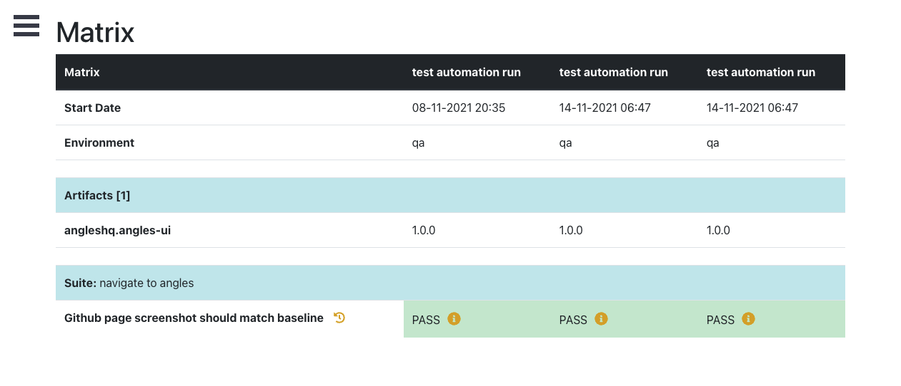

# angles-webdriverio-example

This repository contains an example of an implementation of how to integrate with Angles using a custom webdriverio reporter.

> **NOTE**: if when running the example it fails on the version of chrome driver, simply update the version accordingly in the package.json file.

### Setup Angles

To run this example test you will need:
1. A local instance of Angles running 
   * see our [github page](https://angleshq.github.io/) for documentation on how to setup your own instance
2. Created the following configurations using the [API](https://editor.swagger.io/?url=https://raw.githubusercontent.com/AnglesHQ/angles/master/swagger/swagger.json):
    * Team
    * Component
    * Environment
    * Phase (This is optional, but very useful for reporting. Examples would be *smoke*, *verification*, *regression*)

for the example below you would need to create:
   - a **team** *'angles'*, 
   - a **component** *'wdio-example'*
   - an **environment** *'qa'*
   - **Optional**: a **phase** *'crossbrowser'* 
     
However, you can use your own values and simply change the config to match your values.

### Set up the WebdriverIO tests

Once you have your own instance running (and have added the necessary config), you can now modify your wdio tests to report into your Angles instance by adding a dependency to the [angles-javascript-client](https://github.com/AnglesHQ/angles-javascript-client):
```shell
npm install angles-wdio-reporter --save-dev
```
Once the angles wdio reporter has been added as a dependency you can include the following custom reporter config into your [wdio.conf.ts](wdio.conf.ts) file.

below is an example of the available config.
```
{
  reporters: [
    [
      AnglesWDIOReporter,
      {
        enabled: true,
        baseUrl: 'http://127.0.0.1:3000/rest/api/v1.0/',
        reportingUrl: 'http://127.0.0.1:3001',
        team: 'angles',
        environment: 'qa',
        component: 'wdio-example',
        phase: 'crossbrowser',
        artifacts: [
          {
            groupId: 'anglesHQ',
            artifactId: 'angles-ui',
            version: '1.0.0'
          }
        ]
      }
    ]
  ]
}
```


> **NOTE**: The **reportingUrl** is only used to print a link to the build, so you can access it quickly.

### Storing artifacts versions
As per the example above, you can see there is an **optional** config for **Artifacts**.
This is to store the version(s) of the **system under test (SUT)** and will help you determine what version of your system the test rain against.

To get these versions you will have to write custom code as each application is different. Some systems provide an API and others will display it on the UI.

I highly recommend doing this, because when comparing builds you can see exactly which version of the SUT the tests ran against (see screenshot below). This will help you determine if a new release caused some test failures.

<div style="width: 80%; padding-left: 2em; padding-top: 1em;">


**Image** : Build comparison matrix example
</div>
